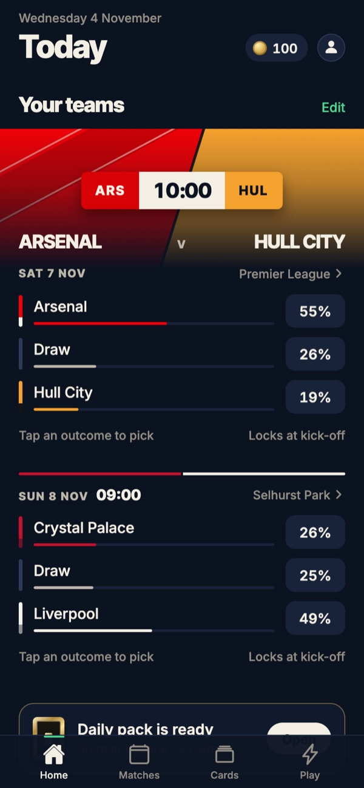
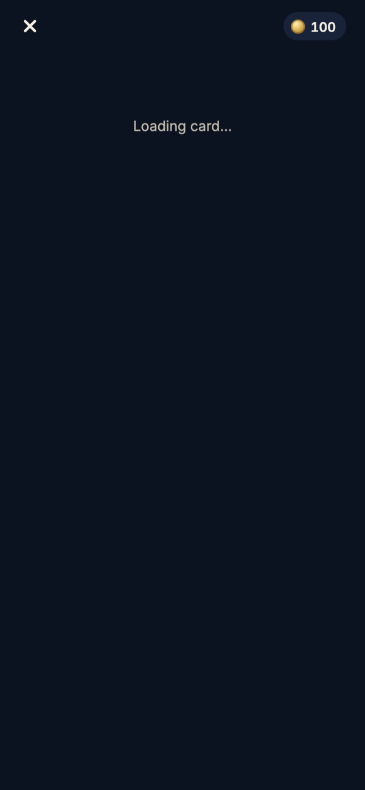
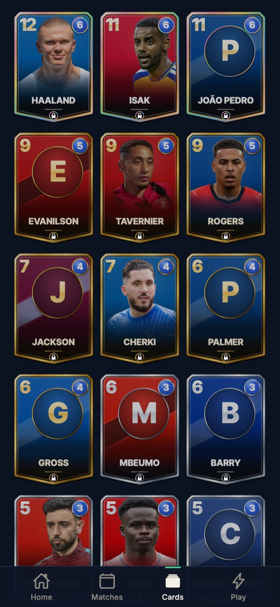
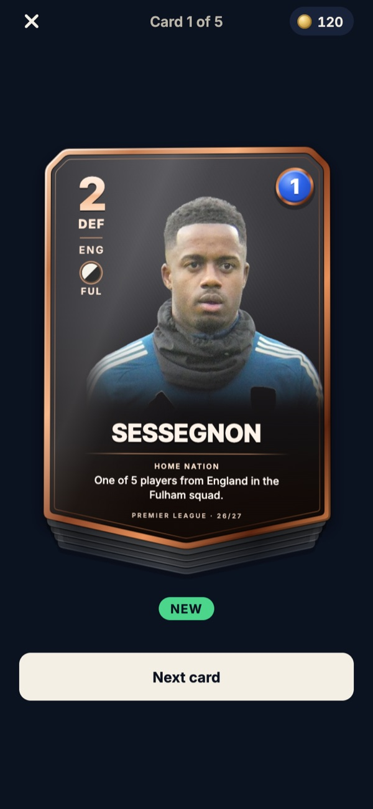
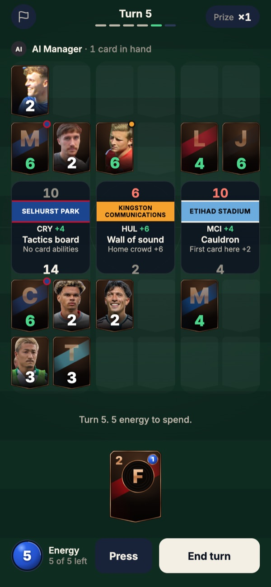
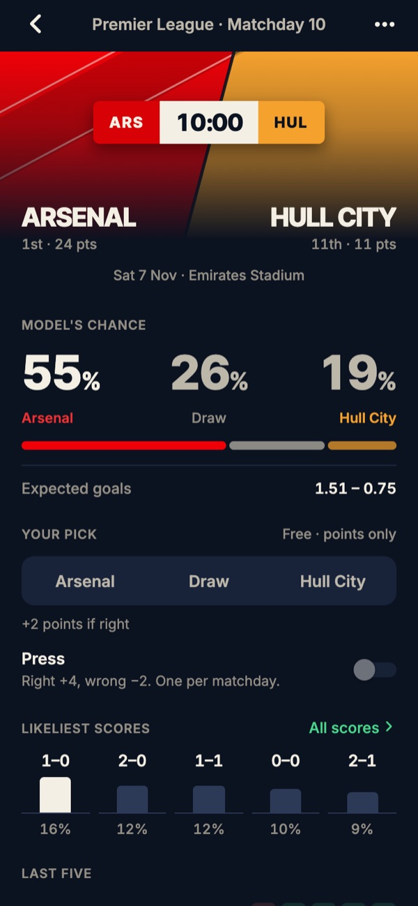

# FootSnap

[](https://github.com/otawfik/Footsnap/actions/workflows/ci.yml)

**A collectible card game for real football, driven by live data and a statistical model.** Every player in Europe's
top five leagues and the Champions League (about 3,000 of them) is a card whose rarity, Power and abilities are
computed from this season's real numbers. You collect them from free daily packs, upgrade them, and play them in a
Marvel Snap-style duel. Every fixture gets a win / draw / loss forecast from a Poisson goals model, and the rest of
the season is simulated 3,000 times so you can ask "what if?". One TypeScript codebase ships to iOS, Android and the web.

**Open it:** [footsnap-app.vercel.app](https://footsnap-app.vercel.app) (installs to the home screen and opens offline) · run it in Expo Go (below) ·
store release guide: [`docs/app-store.md`](docs/app-store.md)

### At a glance

| | |
|---|---|
| **Platforms** | iOS, Android and web from one Expo / React Native codebase (TypeScript, strict); the web build is an installable PWA that opens offline |
| **Data** | Live fixtures, tables, scorers and squads for 6 competitions, through a serverless edge-cached proxy |
| **Model** | Poisson goals model (Maher 1982, the base of Dixon & Coles 1997) fitted by maximum likelihood, plus a Monte Carlo season simulator with parameter uncertainty and common random numbers |
| **Game** | ~3,000 auto-generated cards, a daily-pack economy, 7 upgrade tiers, and a turn-based duel engine with an AI opponent |
| **Computer vision** | An automated art pipeline: Wikipedia / Wikidata photo matching verified by date of birth, background removal (U²-Net), face alignment (YuNet), face verification (SFace) and quality gates, giving 1,335 licence-credited player cut-outs |
| **Quality** | 233 unit tests (Vitest); CI runs typecheck, tests, `expo-doctor`, a native-compat check and a full web build on every push |
| **Cost to run** | $0: free data tier, free hosting; the API key never leaves the server |

### Engineering highlights

- **A forecast that shows its work.** Team attack and defence strengths are fitted by iterative scaling to the
  maximum-likelihood solution, starting from last season's strengths so a few early results can't swing the ratings
  (backtested on 2,105 matches). Walk-forward on 1,894 matches across five leagues it calls 51.1% of results against
  44.1% for always backing the home side, with a Brier score 8.5% better than the league's own averages. Each match
  page shows the full scoreline probability grid the forecast comes from.
- **The chance through the match, without inventing data.** Live and finished match pages chart home / draw / away
  from kick-off to full time with an in-play model on top of the forecast. The free data has no goal minutes, so
  the curve is drawn only where the score is known to have held, and stretches with goals are marked as such.
  At half-time it scores a Brier of 0.482 against 0.505 for the half-time score alone (3,536 held-out matches).
- **What a result meant.** Every finished league match shows how it moved each side's title, top-four and
  relegation chances: the same 2,000 simulated seasons from the table at kick-off, ranked with the result and with
  the match left to chance, so the change is the result alone (about 130 ms per match page).
- **"What if?" that only moves what it should.** The season simulator pins any results you set and re-runs the
  rest. Common random numbers mean only the clubs your result actually affects change, not noise from re-rolling.
- **A shared rate limit, spent once.** The free data tier allows 10 requests a minute. A Vercel edge function holds
  the key, allowlists four upstream paths, and caches each resource for an appropriate time (30 s to 12 h), so one
  upstream call serves every user. When the tier is busy, the edge keeps serving the last good copy, and the app
  falls back to a saved copy when offline.
- **Cards that are always true.** Every ability is a fact computed from the data ("Leads the Premier League with
  9 goals", "The only player from Japan in the Premier League"), never invented.
- **Art at scale, legally.** Only freely licensed Wikimedia Commons photos are used, matched to the right player by
  date of birth and credited on every card. Every face is detected, levelled and framed identically, and blurry or
  badly cropped photos are rejected automatically. The App Store build ships with photos and crests switched off
  (a build flag), for image rights.

### FootSnap 2.0

A calm dark interface with a sports-broadcast feel. Colour comes from football itself: every fixture opens with a
TV-style score bug in the two clubs' kits, match pages split diagonally between the two kits, club pages are headed
in the club's colours, and picks fill in your team's colour. Forecasts read as market-style probability rows with
one-tap free picks (points only, nothing to buy or bet), and the cards are collectibles with metal rarity rims, real
stat lines and tilt-reactive foil. Design spec: [`docs/redesign/SPEC.md`](docs/redesign/SPEC.md).

<p>
  
  
  
</p>
<p>
  
  
  
</p>

## What's in it

**Cards.** Every player has a card. Rarity is their rank by goals × 2 + assists: the top 3 in each competition are
Icon, 4–10 Gold, 11–20 Silver, everyone else Bronze. Each rarity has its own metal rim (copper, chrome, gold, and an
iridescent holo for Icon). The big number is Power (goals × 2 + assists) or age. Abilities are always true statements
computed from the data, such as "Leads the Premier League with 8 goals", "3 of 8 goals from the penalty spot", or
"The only player from Japan in the Premier League". The face is lit in the colours that club actually wears, from a
kit table for every club in the six competitions, with text that darkens automatically until it clears 4.5:1. The
art is the player's own photo, cut out of its background and framed identically on every card (same head size, eyes
on the same line); players without a free photo get an engraved monogram in club colours. Cards tilt with the
phone's gyroscope, carry foil on Gold and Icon, and flip to show full stats and exactly how each number was worked out.

**A collection system modelled on Marvel Snap's.** A free daily pack per league (odds shown, nothing to buy), credits
from packs, duplicates and correct picks, and boosters per card from duplicates. Spend them to upgrade a card
through seven tiers, each with a visible effect: Breakout (the player breaks out of the frame), Depth (3D parallax),
Pulse (animated glow), Crest, Holo, and Legend, a black-and-gold frame with a random Gilded, Prismatic, Crackle or
Starfield finish. A Collection Level with milestone rewards ties it together.

**Who's this?** A mystery card shows its cost, Power, rarity, position, age and club colours, with the player's
silhouette and the name hidden. Name the player from four options to unlock their **Premium** variant: the
player with a white sticker outline, a deeper club-colour backdrop and a gold name. Five a day.

**Duel, a card game with the cards you've collected.** Twelve-card decks, six turns, three real stadiums from the
league (football-data's own venue names). A club's players get +4 Power from the home crowd at their ground, and
each ground has a twist that shows as the match goes on (Cauldron, Heavy pitch, Wall of sound, Tactics board...).
Both sides play face down and reveal together. Win two stadiums to win. Every card's cost, Power and ability come
from the player's real data: a signature for the 30 biggest stars, a role from the season (top scorer, penalty
taker, playmaker...), age or passport, or a mechanic for his position, each with the fact it's built from. Press to
double the prize when you think you're winning, or retreat. Decks are built from your collection on a curve, topped
up with loan players. The AI manager plays the same rules with a deck of the same costs; `scripts/duel-sim.ts`
plays it against itself on the five leagues to keep the balance honest.

**The table, three ways.** The official standings; a **time machine** that replays the season matchday by matchday,
with rows gliding to their new places; and **odds** from 3,000 simulated seasons. The **what-if machine** lets you
set the score of upcoming games and re-simulates the rest of the season. Thanks to common random numbers, only the
clubs your result really affects move.

**Matches and clubs.** Live scoreboards with rolling digits and a goal flash; every fixture with home / draw / away
odds; match pages with a tappable scoreline heatmap, the points race and each side's key card; club pages with the
season's position chart, attack and defence ratings, projections and the squad as cards.

**Picks.** Call the next matchday, Press one pick to double the stakes (+4 or −2), and play against the model, whose
calls are made only from results before each match.

**Beat the model.** Call home, draw or away and say how sure you are: Lean (50%), Likely (70%) or Sure (90%), with
the rest split between the other two outcomes. When a match finishes, your call and the model's forecast are both
scored with the multi-class Brier score from the model page, and the page keeps the record: your average against
the model's, how many matches are scored, who is ahead, and each match side by side. It's a fair fight by
construction ([`lib/beat.ts`](lib/beat.ts)): calls can't be made or changed after kick-off (one changed later is
never scored), the model's forecast is the walk-forward one fitted on results before the match's day (the same one
"How good is the model?" scores), shown on this page from kick-off, and only finished matches with both forecasts
count. Calls stay on the device.

So the page means something before your first result, it also shows how simple ways of filling it in did last
season, labelled as historical: computed on the device from last season's results, walk-forward, each league
starting from the season before as the live model does. Across the five leagues in 2025-26 (1,597 matches after
each league's first 30 results, [`scripts/beat-strategies.ts`](scripts/beat-strategies.ts)):

| 2025-26, five leagues | Brier (lower is better) |
|---|---|
| **FootSnap model** | **0.601** |
| league H/D/A rates so far | 0.655 |
| home win at Lean (50%), every game | 0.657 |
| a third each | 0.667 |
| home win at Sure (90%), every game | 0.975 |

Being sure is expensive: right at 90% scores 0.015, wrong at 90% scores 1.715. The Premier League was the hardest
to forecast (model 0.626 against 0.661 for the league's rates), Bundesliga the easiest (0.583 against 0.657).

## The model

Goals are modelled as independent Poissons (Maher, 1982; the base of Dixon & Coles, 1997):

```
home goals ~ Poisson( mu_home · attack[home] · defence[away] )
away goals ~ Poisson( mu_away · attack[away] · defence[home] )
```

`mu_home` and `mu_away` are the season's average home and away goals, so home advantage is learned rather than
assumed. Attack and defence are fitted by iterative scaling, which converges to the maximum-likelihood fit while
accounting for who each team has played. Outcome probabilities come from summing the 11 × 11 scoreline grid.

**Starting from last season.** Each league season starts every team at its strength from last season, pulled 15%
of the way back toward average (in log space), worth 16 games of evidence; promoted clubs start where the relegated
clubs were. Both numbers were tuned by a walk-forward backtest on 2,105 matches across the five leagues (2025-26 and
2026-27, each predicted only from games before its day): against the old prior of eight league-average games, the
Brier score fell from 0.613 to 0.599 overall and from 0.628 to 0.597 in the first ten rounds. The difference shows in
the title race: nine games into 2026-27, the old prior made Brighton (+17 goal difference, 5 points off the top) a
43.7% title pick; starting from last season, Arsenal lead at 49%, Man City 23%, Brighton 21%. The Champions League
keeps the league-average prior, since its field changes every year.

**Against baselines.** Walk-forward across the five leagues (2025-26 and 2026-27 to date), scoring every match
once its league season had 30 results (1,894 matches), each forecast only from games before its day
([`scripts/baselines.ts`](scripts/baselines.ts)):

| | FootSnap model | always the home side | league H/D/A rates so far | a third each |
|---|---|---|---|---|
| accuracy | **51.1%** | 44.1% | 43.3% | 33.3% |
| Brier score (lower is better) | **0.599** | | 0.655 | 0.667 |
| log loss (lower is better) | **1.003** | | 1.083 | 1.099 |

That's 8.5% better Brier than the league-rate forecast and 10.2% better than knowing nothing. For scale, bookmakers'
closing odds usually call 53-55% of results; this model is fitted to results alone (no lineups, injuries or
market information), so it doesn't claim to beat the market.

The record shown in the app is honest by construction: each finished match is predicted from a fit on matches
before its day, and scored on accuracy and multi-class Brier score against two baselines. Code:
[`lib/model.ts`](lib/model.ts). The unit tests check it against simulated seasons with known strengths: the fit
recovers the strength order and home advantage, and the walk-forward test beats both baselines when teams differ
and doesn't when they're identical.

**In-play: the chance through the match.** Once a match kicks off, the goals still to come are Poisson with the
forecast's expected goals scaled by the share of the match left, and the final score is the current one plus those
goals ([`lib/inplay.ts`](lib/inplay.ts)). At 0' that is exactly the pre-match forecast; at full time the result is
certain. Two adjustments, both measured on 2021-22 to 2023-24 in the five leagues (football-data.co.uk CSVs):
goals aren't spread evenly (45.1% come before half-time, so the second half's rate is higher), and score state
matters (sides behind at half-time scored 10.9% more second-half goals than the model expected, sides ahead 3.5%
fewer, so the rest of the match is scaled by those factors). The forecast is for the 90-minute result; extra time
and penalties aren't part of it.

*What the curve is built from.* football-data.org's free tier gives the score at half-time and full time, and the
current score while a match is on, but no goal minutes and no match clock (those are in its paid tier). So the
match page uses checkpoints: kick-off (0–0), half-time, full time and, live, now. Between two checkpoints with the
same score the curve is exact, minute by minute. Where the score changed, the data doesn't say when, so that
stretch is shaded, labelled with the goals in it, and its ends are joined by a dotted line rather than a guessed
path. Live, the minute is estimated from the kick-off time, and the free feed's scores can arrive a few minutes late;
the page says both.

*Backtest at half-time* ([`scripts/inplay-backtest.ts`](scripts/inplay-backtest.ts)): 3,536 matches in the five
leagues from 2024-25 to 2026-27 (to November), each with the shipped pre-match forecast made walk-forward, then the
in-play forecast from it and the half-time score, scored against the 90-minute result. The constants come only from
earlier seasons.

| at half-time | Brier (lower is better) | log loss |
|---|---|---|
| **in-play model** | **0.482** | **0.820** |
| in-play, without the score-state factors | 0.483 | 0.823 |
| in-play, goals spread evenly over both halves | 0.485 | 0.826 |
| half-time score alone (how often each half-time margin ended H / D / A, 2021-24) | 0.505 | 0.860 |
| the forecast before kick-off | 0.593 | 0.994 |

The half-time score does most of the work, as it should; knowing who is playing is worth a further 0.023 Brier.
Calibration: grouped by the chance it gave, its forecasts land within 2 points of what happened in eight of ten
10% bands; the misses are 50-60% (said 54.9%, happened 58.3%) and 70-80% (said 74.9%, happened 70.0%). Without the score-state factors the half-time leader's win chance
was 3.5 (home) and 5.3 (away) points too high; with them, 1.0 and 2.3.

**What this result means.** On a finished league match page ([`lib/impact.ts`](lib/impact.ts)), the league is
rebuilt as it stood at kick-off: every result from before it stays in the table, and this match and every other
game not yet played at that moment (including ones kicking off at the same time) go back to "to play". The
season simulator then plays out 2,000 seasons once and ranks each of them twice, with this match left to chance
and with its real score (`simulateVariants` in [`lib/season.ts`](lib/season.ts)). Both rankings use the same
simulated seasons and the model as it stood before the match day, so the gap between them is this result and
nothing else, not simulation noise. The page shows title, top four and relegation (top eight and out in the
Champions League's league phase) before → after, leaves out stakes under half a percent either way, and labels
it as model output with the simulation count. The table is rebuilt from results, so a points deduction isn't
in it.

Measured with [`scripts/impact-timing.ts`](scripts/impact-timing.ts) on all 533 finished league matches of
2026-27 so far (five leagues and the Champions League league phase, on a laptop with Node 22): median 130 ms per
match page, 90th percentile 156 ms, worst 559 ms (an early-season game with the most fixtures left). Ranking the
same draws twice halved the cost of two separate simulations. Of the 840 sides in decided games, 838 moved the
right way (winners up, losers down); the other two moved by one simulated season in 2,000 (0.05 points), when a
narrow win was set against the bigger wins the "before" run also allows for on goal difference. The biggest move
so far: Feyenoord 0–3 Inter in the Champions League took Inter's chance of going out from 50% to 25%. The unit
tests check the table at kick-off, that every chance stays in [0, 1] and is a whole number of the 2,000 seasons,
that a win never lowers the winner's chances, and that clubs not involved keep exactly the same expected points.

**Season simulation.** Each simulated season redraws every team's strength around its fitted value (log-normal,
wider for teams with fewer games). Treating fitted strengths as certain made the simulator absurdly confident ten
games in: one side had a 95% title chance. Remaining fixtures are drawn from the model, added to the official
table, and ranked by points, goal difference and goals scored.

## Architecture

```
app (iOS / Android / web)  ──►  /api/fd  (Vercel function)  ──►  football-data.org v4
                                 holds the API key
                                 path allowlist
                                 edge-cached per resource
```

- **The key never ships in the app.** It lives in the server's `FOOTBALL_DATA_KEY` environment variable. Earlier
  versions bundled it into the client, which on the web build meant anyone could read it.
- **One upstream request serves everyone.** The free tier allows 10 requests a minute. Each response is cached at
  Vercel's edge (fixtures 30 s, tables 2 min, scorers 15 min, squads 12 h), so that budget is shared across all
  users instead of spent per user. The app also de-duplicates in-flight requests and keeps short-lived copies, so
  switching tabs doesn't re-fetch.
- **When the free tier is busy, nothing breaks.** The edge keeps serving the last good copy (long
  stale-while-revalidate windows), and the app retries on its own once football-data.org's per-minute counter
  resets, using the reset time it reports.
- **Only four kinds of upstream path are allowed** (`competitions/{id}/matches|standings|scorers|teams` for the six
  supported competitions), with query parameters filtered, so the proxy can't be used as an open relay.

## Install it (web)

The web build is a Progressive Web App: open it in Chrome or Edge and choose Install, or in Safari on iPhone use
Share → Add to Home Screen. It opens full screen with its own icon.

- **Manifest and icons.** `public/manifest.webmanifest` (standalone, the app's navy `#102040` as theme and splash
  colour, 192 and 512 px icons made from the app icon, the 512 also as a maskable icon since the artwork sits inside
  the safe zone), plus an apple-touch-icon and the iOS meta tags, all set in [`app/+html.tsx`](app/+html.tsx), the
  HTML Expo Router wraps around every pre-rendered page.
- **Offline.** [`public/sw.js`](public/sw.js) keeps the app shell: at install it stores the main pages (dynamic
  routes like `/match/123` share one template copy) and the bundle and fonts they load. Pages are network first,
  so a new deploy shows up on the next launch; the content-hashed bundle and fonts are cache first; player art is
  served from cache and refreshed behind.
- **No stale scores passed off as live.** The worker never caches the football data (`/api/`). Offline, the app
  shows its own last saved copies under an "Offline · showing data saved at 14:32" line, as it already did.

Checked in headless Chrome: no manifest or installability errors, the worker registers and controls the page, and
with the network off `/`, `/matches`, a match page and a card page all open from the cache with the offline line.

## Run it

```bash
npm install
npx expo start          # scan the QR code with Expo Go, or press i / a for a simulator
npm run test            # 233 unit tests: model, in-play chance, simulator, result impact, cards and abilities, collection, packs, picks, Beat the model, proxy
npm run typecheck
```

Expo Go and simulators talk to the deployed server, so no key is needed locally. To run your own server, deploy
this repo to Vercel, set `FOOTBALL_DATA_KEY` (free at
[football-data.org/client/register](https://www.football-data.org/client/register)), and point the app at it with
`EXPO_PUBLIC_API_BASE=https://your-deployment.vercel.app`.

CI typechecks, runs the tests and `expo-doctor`, and compiles the iOS, Android and web bundles on every push.
Releasing to the App Store and Google Play: see [`docs/app-store.md`](docs/app-store.md).

## Project structure

```
app/
  (tabs)/index.tsx        Matchday: live scoreboards, fixtures with odds, results
  (tabs)/table.tsx        standings, time machine, projected odds, what-if machine
  (tabs)/cards.tsx        collection: level, daily pack, Who's this?, every player's card
  (tabs)/duel.tsx         Duel lobby: your deck, record, rules
  (tabs)/picks.tsx        picks with a Press, against the model
  card/[id].tsx           one card: tilt, flip, upgrade, Premium variant
  pack.tsx                opening the daily pack
  guess.tsx               Who's this?
  arena.tsx               the Duel board
  beat.tsx                Beat the model: your calls against the model's, by Brier score; last season's strategies
  match/[id].tsx          the chance through the match, what the result meant, scoreline heatmap, points race, key cards
  club/[id].tsx           position chart, ratings, projection, fixtures, squad cards
  about.tsx               data sources, privacy, support links
  +html.tsx               the web page head: manifest, icons, iOS tags, service worker registration
api/fd.ts                 the Vercel proxy (holds the football-data.org key)
components/
  SnapCard.tsx            the card: rarity frames, foil, tilt, flip, upgrade tiers, Premium
  ui.tsx                  design-system primitives
  Match.tsx, Charts.tsx   scoreboards, fixture cards, SVG line charts
  WinChance.tsx           the chance-through-the-match chart (scrub or hover to read a minute)
  ResultImpact.tsx        what this result means: each side's season chances before and after
lib/                      pure logic, unit-tested
  model.ts                Poisson model, odds, scoreline grid, walk-forward backtest
  inplay.ts               in-play chance: time left, score state, checkpoints from the data
  season.ts               Monte Carlo season simulator (what-if pins, several pin sets per pass), table replay, trajectories
  impact.ts               the league at a past kick-off; season chances with and without a result
  cards.ts                rarity, Power and abilities from real data
  game.ts, decks.ts       the Duel engine and AI; deck building
  art.ts                  player cut-outs (optional per build)
  collection.ts           credits, boosters, upgrade tiers, finishes, Collection Level
  packs.ts, guess.ts      daily packs; Who's this? puzzles
  picks.ts                scoring, the model's calls, you vs the model
  beat.ts                 Beat the model: calls to forecasts, locking, Brier record, simple strategies
  colors.ts               club colours from football-data.org's text
  football.ts, proxy.ts   helpers; proxy allowlist and cache policy
services/api.ts           client: base URL, request sharing, saved copies for offline, optional crest stripping
constants/design.ts       the design system: tokens with measured contrast, Inter type (spec: docs/redesign/SPEC.md)
public/                   privacy policy and support pages, the web app manifest, icons and service worker (sw.js);
                          art/ holds the player cut-outs
scripts/art/              the photo pipeline (below)
```

## Data and credits

Football data from [football-data.org](https://www.football-data.org). The in-play model's constants and its
backtest use the free results files from [football-data.co.uk](https://www.football-data.co.uk/data.php) (not
shipped with the app). Player photos come from Wikimedia
Commons via each player's Wikipedia / Wikidata entry, credited on every card with the photographer, the licence and
a link. They're modified (cropped, background removed), and modified photos keep their original licence. A
photo is only used when the Wikidata birth date matches the squad's, so a namesake never ends up on someone
else's card. `scripts/art/` rebuilds the set; about a third of players have one that passes the quality checks (and a look by eye), and the rest get a shirt in their
club's colours. The App Store build leaves photos and crests out (see [`docs/app-store.md`](docs/app-store.md)). FootSnap is an independent app, not affiliated with any league, club or football-data.org.

React Native · Expo SDK 54 · Expo Router · TypeScript · Vercel Functions · Vitest
